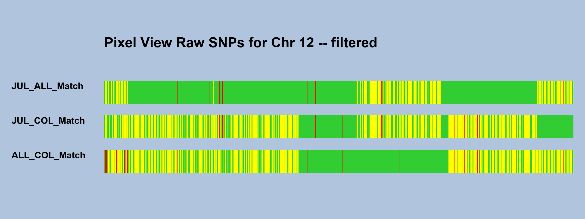

# PixelChromosomeView

## Introduction

Genetic genealogists have developed a process, commonly known as "Visual Phasing", that facilitates locating and assigning genetic recombination points in a given chromosome.

The general procedure is to compare the fully identical regions (FIR) and half identical regions (HIR) between pairs of siblings in a group of three or more.

The data for Visual Phasing is derived from one-to-one comparison tools, such as are provided by GEDmatch.com or other sources.

The visual phasing process can be cumbersome and complicated because the GEDmatch.com tools allow only one-to-one renderings of only two siblings at a time, each in a separate report.

Many times these separate reports don't play well together due to different testing protocols of original tests by AncestryDNA, 23andMe, MyHeritage, etc.

This is a utility program that presents side-by-side visual comparison among a group of siblings, displaying each possible sibling pair in a compatible format.



## Installation and use

**Dependencies**

Python3 -- program developed with Python3.8 but expected to work in any version

Obtain the current version from [Python.org](https://www.python.org)


PILLOW -- the currently maintained fork of PIL (Python Image Library)

Install as `pip install PILLOW`

**Verify Installation**
In a command prompt (windows) or terminal (mac):

type `which Python3` to verify Python3 installation on a Mac
type `where Python3` to verify Python3 installation on Windows
type `python3` and then, at the resulting `>>>` prompt, type `import PIL`

If no errors, you are good to go.

You can quit python by typing `quit()`

**Create a data sub-directory**
In the same folder you placed this program, create a sub-directory

Example: `raw_dna`

**Copy all relevant raw DNA files to your data directory**

The **file names** of the saved raw DNA files must:

1. Contain the name of the source vendor (i.e. 'AncestryDNA', '23andMe', 'MyHeritage', etc)

2. Contain the person's name

3. Contain the word 'raw'

4. Lastly, raw data must must be in  .txt files

Example: `23andMe_JULIE_raw_dna.txt`

Note: FTDNA raw downloads come as comma separated values (csv),
and they will need to be saved in tab-separated-values (tsv)
in the format of .txt files.  This can easily be done with
Excel or other spreadsheet programs.


## Edit the pixel_config.py file
**Set these two variables:**
```
DATA_FILE_DIRECTORY = 'raw_dna'
siblings_to_render = ['JULIE', 'ANDREW', 'JANE']
```
(IMPORTANT: sibling names must match raw dna file name)
## Run the program

In a command prompt / terminal, type
`python3 -m pixel_chromosome_view`

## Get help

email neil.millikin@gmail.com for assistance
